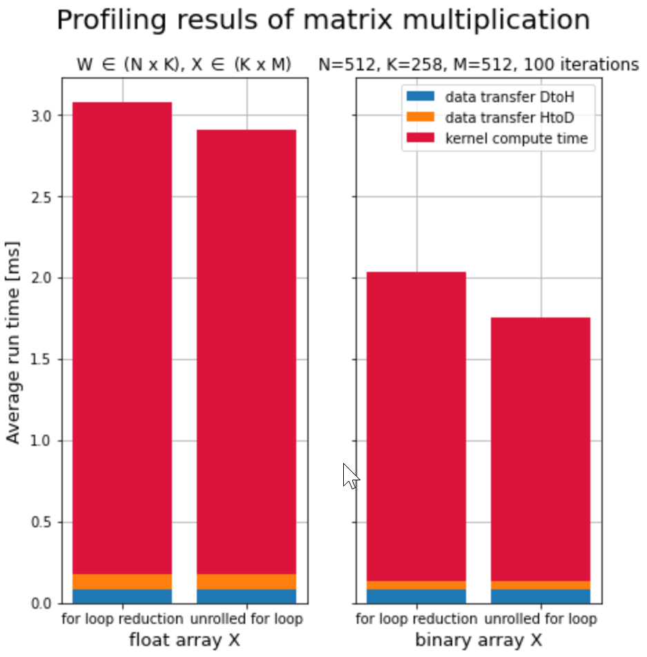

# CUDA-kernel

## branch `prototype`
### `kernel_definitions.cu`

This is my first protype for matrix multiplication implemented in CUDA. 

This algorithm calculates the following matrix multiplications:

> Z = W * X

where W \in (N x K), X \in (K x M) and Z \in (N x M).

Essentially, each element of the resulting matrix is calculated in a separate Thread Block via an inner product of a row and a column vector. The necessary data is loaded into an array in shared memory of each block (since it can be quickly loaded from there). While loading, the elementwise multiplication is performed. In a second step, the shared memory array is summed up (using parallel reduction). For an improvement in performance, the for-loop for this process was unrolled.

Additionally, I developed a second kernel idential to the first. The only difference was that `X`, a matrix full of 1's and 0's, was packed into a bit array. This reduces the size of `X` by roughly 32, since in it's original implementation was an array of floats. 

Unexpectedly, this did not only improve the time required for copying data from the Host to the Device, but also drastically cut the computation time of the kernel by about 30%. I assue this is caused by the higher information density of the bit array, which leads to fewer cache misses.

  

## branch `cutlass`
