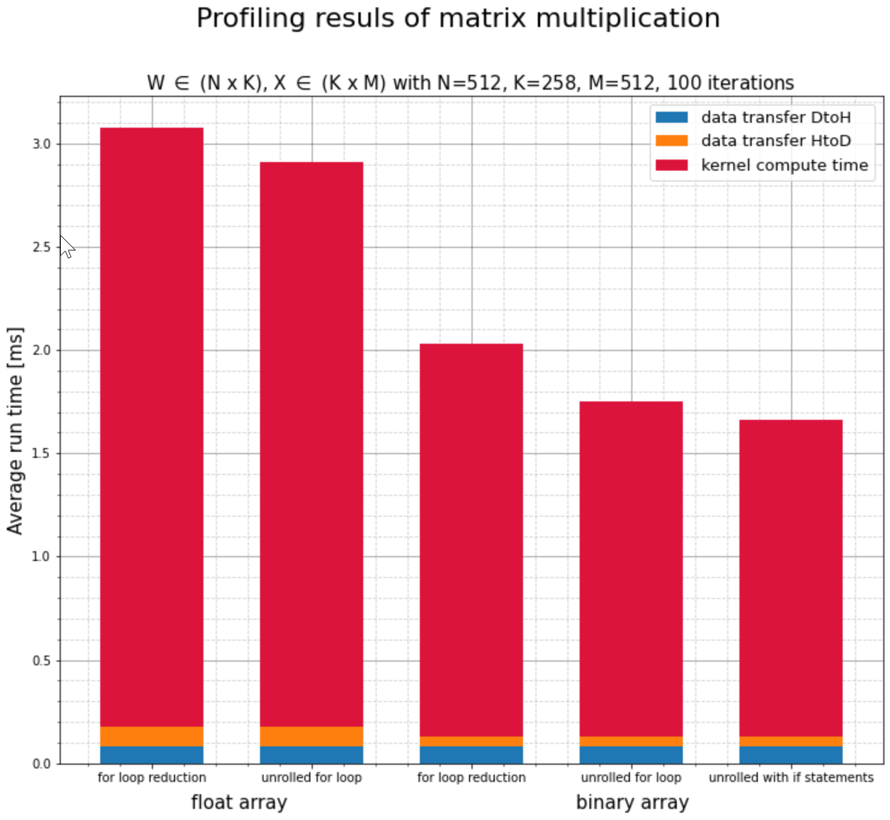

# CUDA-kernel

## branch `main`
New, OOP-based implementation of the RSNN classifier. The CUDA files (denoted by the .cu file extension) contain the source code for the forward and backward pass operations. The C++ files (denoted by the .cc file extension) contain the code excessay to bind together the CUDA operations and the respective Python commands, allowing us to access the former using the latter.

This project was implemented using Python 3.9 and CUDA Toolkit 11.6. It was developed on GPUs with a CUDA Compute Capability of 6.0, but can also be used with CUDA Compute Capability 5.0.

### Manual Setup
After creating a new Python environment (e.g. using Conda), you can set up the necessary dependencies by running:

```
pip install -r requirements.txt
```

Next, we'll compile the shared library (a .so file) from the CUDA  and C++ source files using the [nvcc](https://docs.nvidia.com/cuda/cuda-compiler-driver-nvcc/ "NVCC Documentation") and the [g++](https://gcc.gnu.org/ "GCC Homepage") compilers. The compilation commands are based off of the following [TensorFlow resource](https://www.tensorflow.org/guide/create_op "Create an op | TensorFLow Core"). First off we need to set up the necessary environment variables by copying the following commands into the command line:

```
TF_CFLAGS=( $(python -c 'import tensorflow as tf; print(" ".join(tf.sysconfig.get_compile_flags()))') )
TF_LFLAGS=( $(python -c 'import tensorflow as tf; print(" ".join(tf.sysconfig.get_link_flags()))') )
```

Now we can begin to compile the code. First, we'll compile the CUDA code into an Object file (with an .o extension)

```
nvcc -std=c++14 -c -o spiking_network.cu.o spiking_network.cu ${TF_CFLAGS[@]} -D GOOGLE_CUDA=1 -x cu -Xcompiler -fPIC --expt-relaxed-constexpr --expt-extended-lambda
```

In a final step, we compile this new object file with the C++ code to create the shared library containing the operations.

```
g++ -std=c++14 -shared -o spiking_network.so spiking_network.cc spiking_network.cu.o ${TF_CFLAGS[@]} -fPIC -lcudart -lcublas ${TF_LFLAGS[@]}
```

### Troubleshooting

#### CUDA Compute Capability

Depending on your hardware, your GPU whose may or may not be supported by your version of the CUDA toolkit. You can look up what CUDA Compute Capability for GPU has on [this page](https://developer.nvidia.com/cuda-gpus "CUDA Compute Capability"). If your CUDA Toolkit version and Compute Capability *are* compatible, the latter may still be deprecated, in which case the nvcc compilation process will terminate successfully, but the generated binary will simply do nothing. 

To solve this, add the following arguments to the nvcc command, substituting the '50' (which stands for Compute Capability 5.0) with your own device's Compute Capability:

```
-gencode arch=compute_50,code=sm_50
```

#### CUDA install path

If your CUDA Toolkit isnt installed under the path `/usr/local/lib64`, you'll have to specify its actual path when running the g++ complilation command. In order for the compilation to run smoothly, you need to specify the library folder of your CUDA Toolkit (the `lib64` directory) using the -L flag as well as its include directory (the `include` directory) using the -I flag (this is a capital i). 

For example, these additionaly compilation commands could look like this:


```
-L/usr/local/cuda-11.6/lib64 -I/usr/local/cuda-11.6/include
```

#### GCC Version

For GCC version starting with 5.2, the CUDA and C++ code can be compiled with C++14 (using the argument `-std=c++14` for the compilation command). Earlier versions only seem to work with  C++11, in which case the argument `-std=c++11` should be used.

### Python Scripts

#### `create_data_set.py`
Loads the EEG recordings from the .gdf files, runs the preprocessing pipeline on them and then saves them into the format defined for the RSNN classifier. These .gdf files can be downloaded from the [BNCI Horizon 2020 website](http://bnci-horizon-2020.eu/database/data-sets). Navigate to '26. Attempted arm and hand movements in persons with spinal cord injury', then download the participate runs P01-P10 and extract the zip files.

Preprocessing pipeline:
* Bandpass filtering ([0.3, 70] Hz, second order, zero-phase Butterworth) of a copy of the EEG recording
* PCA performed on this copy
* The principal components explaining 99% of the variance are kept.
* These components are used to project the original, unfiltered EEG recording into the component space and then back into channel space (low rank projection that gets rid of the remaining 1% of variance, likely to be noise)
* This projected data is then bandpass filtered ([0.3, 3] Hz, second order, zero-phase Butterworth)
* Finally, the data is rereferenced to a Common Average Reference (CAR)

Then, the recordings are split into 3 second samples and assigned their attempted movement class: Hand open, supination, pronation, palmar grasp, lateral grasp and rest (equivalent to none of the above) via one-hot encoding. Then, they are separated into train, validation and test sets and or arranged into minibatches. These are then saved to disk.

The user can change the script's behavior by specifying the following parameters/flags:
* --dest: Specifies the input directory containing the extracted folders of the participants (P01-P10), which in turn each contain the .gdf files of each run. Additionally, the finished data sets will be saved to a subdirectory 'dataset' in this folder
* -b, --batch_size: The number of samples within each minibatch. Must be an integer, default is 32
* -r, --down_sample_rate: Factor by which the EEG recordings should be downsampled during preprocessing. Optional, by default no downsampling is performed
* -v, --explained_variance: Defines how much variance should be explained by the Principal Components kept from the PCA step
* -s, --data_split: The ratios of how to split the data into train, validation and test data sets. Default values are 0.8, 0.1 and 0.1, respectively.


#### `train_rsnn.py`
A script to train an RSNN classifier. After training, the classifier is evaluated on the validation set (if available) and test set. The model parameters and hyperparameters are then saved to an .hdf5 file.

The user can change the script's behavior by specifying the following parameters/flags:
* -d, --data_set_path: Specifies the input directory containing the data that will be used for the training. Default is the cwd
* -o, --output_dir: Specifies the output directory to which the .hdf5 file with the model parameters will be saved. Default is the cwd

The user can run this script with a custom data set, as long as the following points are considered:

* Train and test data sets must be included, the use of a validation set is optional
* Each data set should consist of a tuple containing two lists, where the first contains the samples and the second the corresponding labels
* Each element of these lists corresponds to a minibatch
* Each sample batch should have the dimensions (TxBxI), where T is the number of time steps in the time series, B is the number of samples in a batch and I is the number of features of the time series at every time step.
* The labels for the samples should be one-hot encoded. Each label batch should therefore have the dimensions (BxO), where B again is the number of samples in a batch and O is the number of output classes. For binary classification or regression, O can be set to 1.

#### `run_time_test.py`
A script to compare the run times of a pure Python implementation with the Python/CUDA implementation. 

The 'forward pass' and 'backward pass' operations of both implementations are run repeatedly for multiple different network sizes and their completion time is timed. The results are saved to a .csv file

The user can change the script's behavior by specifying the following parameters/flags:
* -i, --input_dir: A required parameter that specifies the input directory containing the data that will be used for the run time test
* -o, --output_dir: A required parameter that specifies the output directory to which the .csv file with the results will be saved
* -n, --network_sizes: Defines the different network sizes for which the run time should be recorded. It is an optional parameter, the default are the sizes 8, 16, 32, 64, 128. 
* -r, --num_repetitions: Optional parameter that defines the number of data points for the timing of the two operations are collected for each network size. The default is 100

## branch `snn_implementation`

Old implementation of the RSNN classifier and run time tests. In the process of reworking into a more user friendly interface


## branch `prototype`

### `kernel_definitions.cu`

This is my first protype for matrix multiplication implemented in CUDA. 

This algorithm calculates the following matrix multiplications:

> Z = W * X

where W \in (N x K), X \in (K x M) and Z \in (N x M).

Essentially, each element of the resulting matrix is calculated in a separate Thread Block via an inner product of a row and a column vector. The necessary data is loaded into an array in shared memory of each block (since it can be quickly loaded from there). While loading, the elementwise multiplication is performed. In a second step, the shared memory array is summed up (using parallel reduction). For an improvement in performance, the for-loop for this process was unrolled.

Additionally, I developed a second kernel idential to the first. The only difference was that `X`, a matrix full of 1's and 0's, was packed into a bit array. This reduces the size of `X` by roughly 32, since in it's original implementation was an array of floats. 

Unexpectedly, this did not only improve the time required for copying data from the Host to the Device, but also drastically cut the computation time of the kernel by about 30%. I assue this is caused by the higher information density of the bit array, which leads to fewer cache misses.


<p align="center">
  
</p>


## branch `cutlass`
